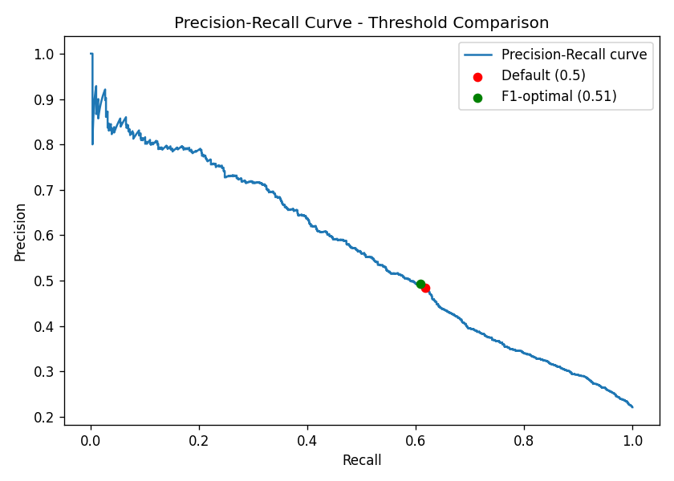
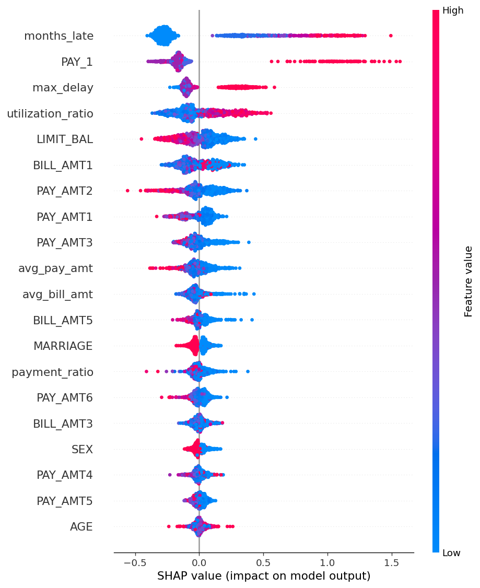

# Model Card - Credit Risk Baseline Models

Dataset: UCI Default of Credit Card Clients (30,000 rows, 22.1% positive class)

Split: 80/20 stratified, random_state=42, scaler fit on train only (no leakage)

## Results

| Model | Accuracy | Precision | Recall | F1 | AUC |
|---|---|---|---|---|---|
| LogisticRegression | 0.7445 | 0.4429 | 0.6021 | 0.5104 | 0.7449 |
| LightGBM | 0.7567 | 0.4627 | 0.6209 | 0.5302 | 0.7778 |

## Notes

- Accuracy alone is misleading here: a model predicting 'no default' for
  every row scores ~78% accuracy while being useless. Precision/recall/F1/AUC
  are the metrics that actually matter for this imbalanced problem.
- Both models use class-imbalance handling (class_weight/scale_pos_weight)
  rather than plain defaults, which would otherwise barely predict the
  minority (default) class at all.
- These are BASELINE, untuned models. Next steps: SMOTE comparison,
  hyperparameter tuning, threshold tuning on the precision-recall curve.

## Day 8-9: SMOTE comparison + tuning

SMOTE did not help over scale_pos_weight alone (F1 0.5004 vs 0.5302), so the tuning search used scale_pos_weight on the original training set.

| Model | Precision | Recall | F1 | AUC |
|---|---|---|---|---|
| Baseline (scale_pos_weight) | 0.4627 | 0.6209 | 0.5302 | 0.7778 |
| SMOTE + LightGBM (untuned) | 0.6008 | 0.4288 | 0.5004 | 0.7703 |
| Tuned LightGBM (final) | 0.4835 | 0.6172 | 0.5422 | 0.7781 |

Best hyperparameters found: `{"n_estimators": 367, "max_depth": 10, "learning_rate": 0.01178303443456443, "num_leaves": 109, "min_child_samples": 81, "subsample": 0.8960730084061344, "colsample_bytree": 0.8626561615432559}`

## Threshold tuning + SHAP

- Default threshold (0.5): F1=0.5422
- F1-optimal threshold (0.5109): F1=0.5447
- Recall-favoring threshold (0.3450, precision floor 0.35): Recall=0.7732

**Chosen threshold for deployment: 0.5109** (maximizes F1; revisit if a real business cost model becomes available).

Top 5 features by SHAP importance:

- `months_late`: 0.3946
- `PAY_1`: 0.2655
- `max_delay`: 0.1615
- `utilization_ratio`: 0.1541
- `LIMIT_BAL`: 0.1172

